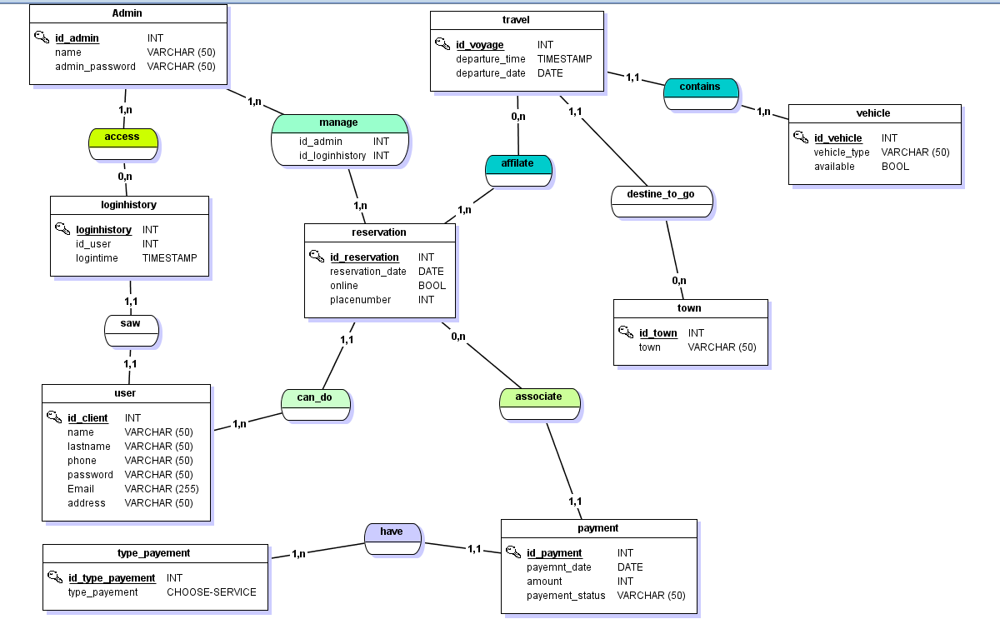

# Agence-de-voyage-Dream-trip-HEI

This repository contains the source code for the back-end developed as part of a university project to create a web application for a travel agency.

# Configuration database:

in ressource/application.propreties change:
spring.datasource.username=your username
spring.datasource.password=password

# MCD:

# complete:
